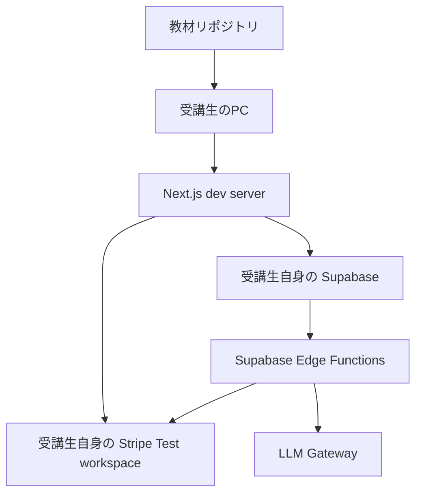

# 受講生向け 環境構築ガイド

このドキュメントは、AILowcode スクールの受講生が **自分の Supabase プロジェクト** と **自分の Stripe ワークスペース** を使って、この教材リポジトリを動かすための手順です。

このリポジトリでは次の構成を使います。

| 項目                       | 技術                             |
| -------------------------- | -------------------------------- |
| フロントエンド / API       | Next.js 16 App Router + React 19 |
| 言語                       | TypeScript 5                     |
| UI                         | Tailwind CSS 4                   |
| DB / Auth / Edge Functions | Supabase                         |
| 決済                       | Stripe                           |
| AI                         | LLM Gateway                      |
| デプロイ                   | Cloudflare Workers / OpenNext.js |
| パッケージマネージャー     | pnpm                             |

---

## 1. このガイドで作る環境

受講生ごとに、以下の環境を個別に作成します。



重要なポイントは次の通りです。

- 他の受講生や講師の Supabase プロジェクトを使わない
- 他の受講生や講師の Stripe API Key / Price ID を使わない
- `.env.local`、`.dev.vars`、`supabase/functions/.env` は Git にコミットしない
- `.env.example` などのサンプルファイルには本物の secret を書かない

---

## 2. 事前に用意するもの

### アカウント

| 必要なもの            | 用途                                |
| --------------------- | ----------------------------------- |
| GitHub アカウント     | リポジトリ取得                      |
| Supabase アカウント   | DB / Auth / Edge Functions          |
| Stripe アカウント     | 決済テスト                          |
| LLM Gateway API Key   | AI チャット機能                     |
| Cloudflare アカウント | Workers preview / deploy を行う場合 |

### ローカルツール

| ツール         | 推奨                                          |
| -------------- | --------------------------------------------- |
| Node.js        | `22.13.0` 以上                                |
| pnpm           | `package.json` の `packageManager` に合わせる |
| Git            | 最新安定版                                    |
| GitHub CLI     | GitHub 認証用                                 |
| Docker Desktop | ローカル Supabase を使う場合に必要            |
| Stripe CLI     | ローカルで Webhook を確認する場合に推奨       |

バージョン確認:

```bash
git --version
node -v
pnpm -v
gh --version
docker --version
```

Node.js が古い場合は、先に Node.js を更新してください。

---

## 3. リポジトリを取得する

GitHub CLI を使う場合:

```bash
gh auth login
gh repo clone ailowcodejp/ailowcode-chatbot-saas
cd ailowcode-chatbot-saas
```

通常の `git clone` を使う場合:

```bash
git clone https://github.com/ailowcodejp/ailowcode-chatbot-saas.git
cd ailowcode-chatbot-saas
```

依存関係をインストールします。

```bash
pnpm install
```

---

## 4. Supabase の接続方式を選ぶ

この教材では、次のどちらかで作業できます。

| 方式              | 使う場面                                | 特徴                                             |
| ----------------- | --------------------------------------- | ------------------------------------------------ |
| リモート Supabase | スクール課題・提出におすすめ            | 自分の Supabase Dashboard 上のプロジェクトを使う |
| ローカル Supabase | DB を安全にリセットしながら試したい場合 | Docker 上にローカル DB を起動する                |

迷った場合は、まず **リモート Supabase** で進めてください。

---

## 5. Supabase リモートプロジェクトを作成する

1. [Supabase Dashboard](https://supabase.com) を開く
2. **New project** をクリック
3. 任意の Organization を選択
4. Project name を入力
5. Database Password を保存する
6. Region を選択して作成する

作成後、Dashboard で次の値を確認します。

| Supabase Dashboard の場所                                  | `.env.local` に入れる変数              |
| ---------------------------------------------------------- | -------------------------------------- |
| Project Settings → API → Project URL                       | `NEXT_PUBLIC_SUPABASE_URL`             |
| Project Settings → API → publishable key / anon public key | `NEXT_PUBLIC_SUPABASE_PUBLISHABLE_KEY` |
| Project Settings → API → service_role key                  | `SUPABASE_SERVICE_ROLE_KEY`            |

> [!warning]
> `SUPABASE_SERVICE_ROLE_KEY` は強い権限を持つ secret です。ブラウザ、Client Component、公開リポジトリに出してはいけません。

---

## 6. Supabase CLI でリモートプロジェクトにリンクする

Supabase CLI はこのリポジトリの `devDependencies` に入っています。グローバルインストールではなく、`pnpm exec` 経由で実行します。

ログイン:

```bash
pnpm exec supabase login
```

リモートプロジェクトにリンク:

```bash
pnpm exec supabase link --project-ref <あなたのproject-ref>
```

`project-ref` は Supabase Dashboard の URL で確認できます。

```text
https://supabase.com/dashboard/project/<ここがproject-ref>
```

---

## 7. DB マイグレーションを反映する

リモート Supabase にテーブル、RLS、RPC などを作成します。

```bash
pnpm run db:push
```

型定義を生成します。

```bash
pnpm run gen:types
```

> [!note]
> `gen:types` はデフォルトではローカル Supabase 向けの型生成コマンドです。リモート DB の型を生成したい場合は、必要に応じて Supabase CLI の `--project-id` を使ってください。

---

## 8. ローカル Supabase を使う場合

ローカル Supabase を使う場合は Docker Desktop を起動してから実行します。

```bash
pnpm run db:start
```

起動後、接続情報を確認します。

```bash
pnpm exec supabase status
```

表示される値を `.env.local` に設定します。

| `supabase status` の表示 | `.env.local` に入れる変数              |
| ------------------------ | -------------------------------------- |
| API URL                  | `NEXT_PUBLIC_SUPABASE_URL`             |
| anon key                 | `NEXT_PUBLIC_SUPABASE_PUBLISHABLE_KEY` |
| service_role key         | `SUPABASE_SERVICE_ROLE_KEY`            |

DB をリセットしたい場合:

```bash
pnpm run db:reset
```

停止する場合:

```bash
pnpm run db:stop
```

---

## 9. Stripe Test workspace を準備する

受講生ごとに、自分の Stripe の **Test mode** で作業してください。

### 9-1. API Key を確認する

Stripe Dashboard で **Developers → API keys** を開き、Test mode の secret key を確認します。

| Stripe の値              | `.env.local` に入れる変数 |
| ------------------------ | ------------------------- |
| Secret key `sk_test_...` | `STRIPE_SECRET_KEY`       |

> [!warning]
> `sk_live_...` は本番用です。学習中は必ず `sk_test_...` を使ってください。

### 9-2. Product / Price を作成する

Stripe Dashboard で Test mode の Product と Price を作成します。

最低 1 つの subscription price が必要です。

| Stripe の値           | env                           |
| --------------------- | ----------------------------- |
| Price ID `price_...`  | `STRIPE_ALLOWED_PRICE_IDS`    |
| 月額プランの Price ID | `STRIPE_PRO_MONTHLY_PRICE_ID` |
| 年額プランの Price ID | `STRIPE_PRO_YEARLY_PRICE_ID`  |

`STRIPE_PRO_MONTHLY_PRICE_ID` / `STRIPE_PRO_YEARLY_PRICE_ID` は任意ですが、月額・年額の両方を作る場合は設定してください。

例:

```env
STRIPE_ALLOWED_PRICE_IDS=price_monthly_xxxxx,price_yearly_xxxxx
STRIPE_PRO_MONTHLY_PRICE_ID=price_monthly_xxxxx
STRIPE_PRO_YEARLY_PRICE_ID=price_yearly_xxxxx
```

### 9-3. Webhook を作成する

リモート Supabase Edge Functions を使う場合の Webhook endpoint:

```text
https://<あなたのproject-ref>.supabase.co/functions/v1/stripe-billing-webhook
```

ローカル Supabase Edge Functions に Stripe CLI で転送する場合:

```bash
stripe listen --forward-to http://127.0.0.1:54321/functions/v1/stripe-billing-webhook
```

Stripe CLI に表示される `whsec_...` を `STRIPE_WEBHOOK_SECRET` に設定します。

Webhook で最低限購読するイベント:

- `checkout.session.completed`
- `customer.subscription.created`
- `customer.subscription.updated`
- `customer.subscription.deleted`
- `invoice.payment_succeeded`

---

## 10. `.env.local` を作成する

Next.js のローカル開発では、ルート直下の `.env.local` を使います。

```bash
cp .env.example .env.local
```

`.env.local` を開き、自分の値に差し替えてください。

```env
# App
NEXT_PUBLIC_SITE_URL=http://localhost:3000

# Supabase
NEXT_PUBLIC_SUPABASE_URL=https://<あなたのProject URL または ローカルAPI URL>
NEXT_PUBLIC_SUPABASE_PUBLISHABLE_KEY=<あなたのpublishable key / anon key>
SUPABASE_SERVICE_ROLE_KEY=<あなたのservice_role key>

# LLM Gateway
LLM_GATEWAY_API_KEY=<LLM GatewayのAPIキー>

# Stripe
STRIPE_SECRET_KEY=<あなたのStripe test secret key>
STRIPE_WEBHOOK_SECRET=<あなたのStripe Webhook署名シークレット>
STRIPE_ALLOWED_PRICE_IDS=<許可するStripe Price ID。複数の場合はカンマ区切り>
STRIPE_PRO_MONTHLY_PRICE_ID=<任意: 月額プランのPrice ID>
STRIPE_PRO_YEARLY_PRICE_ID=<任意: 年額プランのPrice ID>

# Redirect allow-list
ALLOWED_REDIRECT_ORIGINS=http://localhost:3000
```

> [!warning]
> `.env.local` は Git にコミットしないでください。

---

## 11. Supabase Edge Functions の secret を設定する

このアプリでは、AI チャットや Stripe Checkout / Webhook の処理に Supabase Edge Functions を使います。

Next.js の `.env.local` とは別に、Edge Functions 側にも secret が必要です。

### 11-1. ローカル Edge Functions 用

```bash
cp supabase/functions/.env.example supabase/functions/.env
```

`supabase/functions/.env` に自分の値を設定します。

```env
NEXT_PUBLIC_SITE_URL=http://localhost:3000
LLM_GATEWAY_API_KEY=<LLM GatewayのAPIキー>
STRIPE_SECRET_KEY=<あなたのStripe test secret key>
STRIPE_WEBHOOK_SECRET=<あなたのStripe Webhook署名シークレット>
STRIPE_ALLOWED_PRICE_IDS=<許可するStripe Price ID>
STRIPE_PRO_MONTHLY_PRICE_ID=<任意: 月額プランのPrice ID>
STRIPE_PRO_YEARLY_PRICE_ID=<任意: 年額プランのPrice ID>
ALLOWED_REDIRECT_ORIGINS=http://localhost:3000
```

### 11-2. リモート Edge Functions 用

リモート Supabase に secret を登録します。

```bash
pnpm exec supabase secrets set --env-file supabase/functions/.env
```

> [!note]
> Stripe Webhook の `whsec_...` は endpoint ごとに異なります。Stripe CLI で取得したローカル用の `whsec_...` と、Stripe Dashboard で作成したリモート endpoint 用の `whsec_...` を混ぜないでください。

登録済み secret の確認:

```bash
pnpm exec supabase secrets list
```

### 11-3. Edge Functions をデプロイする

リモート Supabase で動かす場合は、Edge Functions をデプロイします。

```bash
pnpm exec supabase functions deploy chat-completion
pnpm exec supabase functions deploy create-billing-checkout-session
pnpm exec supabase functions deploy create-billing-portal-session
pnpm exec supabase functions deploy stripe-billing-webhook
```

---

## 12. Cloudflare Workers preview 用 `.dev.vars` を作成する

Cloudflare Workers の preview / deploy を確認する場合は `.dev.vars` を作成します。

```bash
cp .dev.vars.example .dev.vars
```

`.dev.vars` にも、自分の Supabase / Stripe / LLM Gateway の値を設定してください。

> [!warning]
> `.dev.vars` も Git にコミットしないでください。

Cloudflare にデプロイする場合は、Cloudflare Dashboard 側の Workers Variables / Secrets にも同じ値を設定します。

---

## 13. 開発サーバーを起動する

```bash
pnpm run dev
```

ブラウザで開きます。

```text
http://localhost:3000
```

初回確認:

1. トップページが表示される
2. サインアップできる
3. ログインできる
4. チャット画面に遷移できる
5. Billing 画面で Stripe plan が表示される
6. Checkout に遷移できる

---

## 14. よく使うコマンド

| 用途                   | コマンド                |
| ---------------------- | ----------------------- |
| 開発サーバー起動       | `pnpm run dev`          |
| 本番ビルド             | `pnpm run build`        |
| Lint                   | `pnpm run lint`         |
| Lint 自動修正          | `pnpm run lint:fix`     |
| Format                 | `pnpm run format`       |
| Format 確認            | `pnpm run format:check` |
| テスト                 | `pnpm run test`         |
| ローカル Supabase 起動 | `pnpm run db:start`     |
| ローカル Supabase 停止 | `pnpm run db:stop`      |
| ローカル DB リセット   | `pnpm run db:reset`     |
| リモート DB 反映       | `pnpm run db:push`      |
| Supabase 型生成        | `pnpm run gen:types`    |
| Cloudflare preview     | `pnpm run preview`      |
| Cloudflare deploy      | `pnpm run deploy`       |

---

## 15. 環境変数一覧

### Next.js / Cloudflare Workers

| 変数名                                 | 必須 | 公開可否 | 説明                                             |
| -------------------------------------- | ---- | -------- | ------------------------------------------------ |
| `NEXT_PUBLIC_SITE_URL`                 | -    | 公開可   | アプリの URL。ローカルは `http://localhost:3000` |
| `NEXT_PUBLIC_SUPABASE_URL`             | ✅   | 公開可   | Supabase Project URL またはローカル API URL      |
| `NEXT_PUBLIC_SUPABASE_PUBLISHABLE_KEY` | ✅   | 公開可   | Supabase publishable key / anon key              |
| `SUPABASE_SERVICE_ROLE_KEY`            | ✅   | 秘密     | サーバー側専用の service_role key                |
| `LLM_GATEWAY_API_KEY`                  | ✅   | 秘密     | LLM Gateway API Key                              |
| `STRIPE_SECRET_KEY`                    | ✅   | 秘密     | Stripe secret key。学習中は `sk_test_...` を使う |
| `STRIPE_WEBHOOK_SECRET`                | ✅   | 秘密     | Stripe Webhook signing secret `whsec_...`        |
| `STRIPE_ALLOWED_PRICE_IDS`             | ✅   | 秘密     | Checkout を許可する Price ID のカンマ区切り      |
| `STRIPE_PRO_MONTHLY_PRICE_ID`          | -    | 秘密     | 月額プランとして扱う Price ID                    |
| `STRIPE_PRO_YEARLY_PRICE_ID`           | -    | 秘密     | 年額プランとして扱う Price ID                    |
| `ALLOWED_REDIRECT_ORIGINS`             | -    | 秘密     | Checkout / Portal から戻してよい Origin          |
| `NEXTJS_ENV`                           | -    | 秘密     | Cloudflare preview 用。通常は `development`      |

### Supabase Edge Functions

| 変数名                        | 必須 | 説明                                 |
| ----------------------------- | ---- | ------------------------------------ |
| `NEXT_PUBLIC_SITE_URL`        | -    | Checkout / Portal の戻り先生成に使う |
| `LLM_GATEWAY_API_KEY`         | ✅   | AI チャットで使う                    |
| `STRIPE_SECRET_KEY`           | ✅   | Checkout / Portal Session 作成で使う |
| `STRIPE_WEBHOOK_SECRET`       | ✅   | Stripe Webhook 署名検証で使う        |
| `STRIPE_ALLOWED_PRICE_IDS`    | ✅   | Checkout で許可する Price ID         |
| `STRIPE_PRO_MONTHLY_PRICE_ID` | -    | 月額プラン判定に使う                 |
| `STRIPE_PRO_YEARLY_PRICE_ID`  | -    | 年額プラン判定に使う                 |
| `ALLOWED_REDIRECT_ORIGINS`    | -    | リダイレクト先 Origin の許可リスト   |

Supabase Edge Functions では、`SUPABASE_URL` や service role key は Supabase 側が標準 secret として提供します。

---

## 16. Git にコミットしてはいけないファイル

次のファイルには本物の secret が入るため、コミットしてはいけません。

```text
.env.local
.dev.vars
supabase/functions/.env
```

コミット前に必ず確認します。

```bash
git status
git diff
```

サンプルファイルはコミット対象です。

```text
.env.example
.dev.vars.example
supabase/functions/.env.example
```

サンプルファイルには空文字またはダミー値だけを書いてください。

---

## 17. よくあるトラブル

### `Missing required environment variable` が出る

`.env.local` に必要な値が入っていない可能性があります。

確認するファイル:

```text
.env.local
```

Cloudflare preview の場合:

```text
.dev.vars
```

Supabase Edge Functions の場合:

```text
supabase/functions/.env
```

リモート Edge Functions の場合は、次も確認します。

```bash
pnpm exec supabase secrets list
```

### Supabase に接続できない

以下を確認してください。

- `NEXT_PUBLIC_SUPABASE_URL` が自分の Project URL またはローカル API URL になっているか
- `NEXT_PUBLIC_SUPABASE_PUBLISHABLE_KEY` が同じ Supabase プロジェクトの key か
- `SUPABASE_SERVICE_ROLE_KEY` が同じ Supabase プロジェクトの key か
- リモートの場合、`pnpm run db:push` を実行したか
- ローカルの場合、`pnpm run db:start` が起動しているか

### Stripe Checkout で `price_id_not_allowed` が出る

`STRIPE_ALLOWED_PRICE_IDS` に、Checkout に渡している `price_...` が含まれていません。

確認すること:

- `STRIPE_ALLOWED_PRICE_IDS` に自分の Stripe Test mode の Price ID を入れたか
- 複数ある場合はカンマ区切りにしたか
- `STRIPE_PRO_MONTHLY_PRICE_ID` / `STRIPE_PRO_YEARLY_PRICE_ID` に入れた ID も `STRIPE_ALLOWED_PRICE_IDS` に含めたか

### Stripe Webhook の署名検証に失敗する

`STRIPE_WEBHOOK_SECRET` が間違っている可能性があります。

- Stripe Dashboard の Webhook endpoint ごとの `whsec_...` を使っているか
- Stripe CLI を使う場合、CLI が表示した `whsec_...` を使っているか
- リモート用とローカル用の `whsec_...` を混ぜていないか

### Supabase Edge Functions が secret を読めない

ローカルの場合:

```bash
cp supabase/functions/.env.example supabase/functions/.env
```

リモートの場合:

```bash
pnpm exec supabase secrets set --env-file supabase/functions/.env
```

設定後、必要に応じて Edge Functions を再デプロイしてください。

### Docker が原因でローカル Supabase が起動しない

確認すること:

- Docker Desktop が起動しているか
- 他のプロジェクトの Supabase が同じポートを使っていないか
- 一度停止してから起動し直す

```bash
pnpm run db:stop
pnpm run db:start
```

---

## 18. セットアップ完了チェックリスト

- [ ] Node.js / pnpm / Git / Docker が使える
- [ ] `pnpm install` が完了した
- [ ] 自分の Supabase リモートプロジェクトを作成した、またはローカル Supabase を起動した
- [ ] リモート Supabase を使う場合、`pnpm exec supabase link --project-ref <project-ref>` が完了した
- [ ] リモート Supabase を使う場合、`pnpm run db:push` が完了した
- [ ] `.env.local` を作成した
- [ ] `supabase/functions/.env` を作成した
- [ ] リモート Edge Functions を使う場合、remote secrets を設定した
- [ ] リモート Edge Functions を使う場合、Edge Functions をデプロイした
- [ ] 自分の Stripe Test mode で Product / Price を作成した
- [ ] 自分の Stripe Webhook endpoint を作成した
- [ ] `STRIPE_ALLOWED_PRICE_IDS` に自分の Price ID を設定した
- [ ] `pnpm run dev` でアプリが起動した
- [ ] サインアップ / ログインができた
- [ ] Billing 画面から Checkout に遷移できた
- [ ] `.env.local`、`.dev.vars`、`supabase/functions/.env` が Git 差分に出ていない

---

## 19. 次に読むドキュメント

| 目的                                 | ドキュメント                                            |
| ------------------------------------ | ------------------------------------------------------- |
| Stripe の Product / Webhook 設定詳細 | `docs/stripe/stripe-dashboard-product-setup.md`         |
| Supabase の環境変数詳細              | `docs/supabase/environment-variables.md`                |
| 開発フロー                           | `docs/development/feature-development-guide.md`         |
| フォルダ構成                         | `docs/coding-guide/11_nextjs-folder-structure-guide.md` |
| Cloudflare デプロイ                  | `docs/deployment/nextjs-cloudflare-workers-deploy.md`   |
